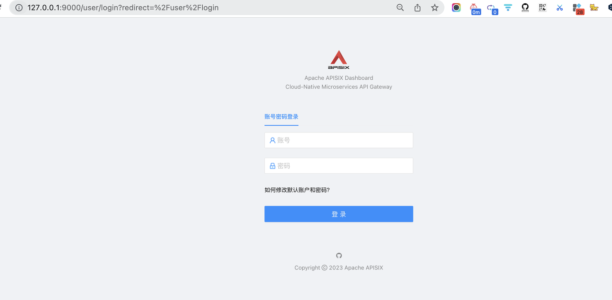

## 搭建chatgpt服务，并使用APISIX进行接口的保护

 

> 在云端部署一个chat GPTAPI服务，并用APISIX进行安全的保护，要求提供架构图和demo配置（无需提供所有实现代码，演示代码即可）

 

### 一. 搭建chatgpt服务

 

(1) . 注册openai并获取apikey。注册方式较简单，接收验证码这一步，需要使用国外的接码平台，预计花费1-2元。

获取apikey

（2）其实只是调用 https://api.openai.com/v1/chat/completions。

前端做一个输入框，用于输入问题，以及展示返回的内容

这部分已实现。这个服务暴露出去后，可能会被滥用，下面部分用apisix为其添加限流等安全防护

---

 

### 二.  安装并使用apisix进行api的保护

 

https://apisix.apache.org/zh/docs/apisix/installation-guide/

https://apisix.apache.org/zh/docs/apisix/tutorials/protect-api/

过程中如有报错，根据报错信息相应解决。

apisix提供了很多插件，如认证，限流，可观测性，以下以限流为例，通过dashboard进行可视化的操作(也可以通过接口)

和之前在网易在应用内做的限流相比，使用apisix，可以在更前面统一做限流操作，不进入业务层。 但限流底层的几种算法大同小异，

这是之前的博客

[常见的几种限流算法](https://dashen.tech/2022/05/02/%E5%B8%B8%E8%A7%81%E7%9A%84%E5%87%A0%E7%A7%8D%E9%99%90%E6%B5%81%E7%AE%97%E6%B3%95/)

 

http://127.0.0.1:9000/user/login?redirect=%2Fuser%2Flogin

默认账号/密码为 admin/admin

其中Upstream是虚拟主机抽象，对给定的多个服务节点按照配置规则进行负载均衡(如果涉及到多台机器/多个节点，可在此配置使用什么负载均衡算法，每个节点的权重等)。此处不涉及多个节点，故而不配置Upstream(`上游`)，仅配置Route(`路由`)极客

---

APISIX 内置了三个限流限速插件：

- limit-count：基于“固定窗口”的限速实现。
- limit-req：基于漏桶原理的请求限速实现。
- limit-conn：限制并发请求（或并发连接）。

提交后执行 curl 127.0.0.1:9090/v1/schema > schema.json

此时5s内连续请求 https://api.openai.com/v1/chat/completions 接口超过一次，会返回503错误码及配置的错误信息

 

其实"保护"不光是限流，认证&鉴权应该在限流之前。

APISIX 内置了四个身份验证插件：

- key-auth：基于 Key Authentication 的用户认证。
- JWT-auth：基于 JWT (JSON Web Tokens) Authentication 的用户认证。
- basic-auth：基于 basic auth 的用户认证。
- wolf-rbac：基于 RBAC 的用户认证及授权。需要额外搭建 wolf 服务，提供用户、角色、资源等信息。

不过auth和rate-limit都有现成的插件，仅有配置参数的差异，操作步骤相差不大，在此便不演示了~

---

以上是较简单的 单机限流demo，如果要做集群级别的限流，需要引入集中式的存储如redis

---

参考  

[使用 Apache APISIX 实现限流限速](https://apisix.apache.org/articles/Speed-Limiting-With-Apache-APISIX/)

 

### 一些领悟

 

之前一直get不到有了nginx/openresty， 为什么还要kong或apisix，因为自己也是openresty用户，博客等都使用openresty做反向代理。

新增一个服务，或者之前的配置有修改，完成修改后仅需要在`/usr/local/openresty/nginx/sbin`执行一下*./nginx -s reload*即可，感受不到痛点

通过查阅文档和相关视频分享，理解对于公司而言，单单就reload这一项，就带来很大的影响

另外，感觉是把这一层"做胖"，将鉴权，限流，熔断，可观测性等集成到里面

(了解了下kong前身的历史，最早是做第三方api的聚合，但这个业务做的不好；反倒是无心插柳的api管理，有很大市场需求)

 

除此还比较有意思的点：

apisix支持可视化的插件编排，低代码化，让插件之间的关系更直观配置更简单

此过程中apisix相较nginx的优势:

请求会先经过一个ip限制插件，会判断流量是内网还是外网，如果是内网ip则使用内网专用的限流配置，实现精细化限流；借助redis，实现集群级的限流

通过以下几种方式，实现动态无需reload即可生效的配置变更 (底层应该是借助etcd)

之前研究过基树树，在gin框架和Go的内存管理中都有使用。之前写博客时还在四处找寻开源项目中基树树的使用

[Trie三兄弟](https://dashen.tech/2020/08/10/Trie%E4%B8%89%E5%85%84%E5%BC%9F/#gin%E4%B8%AD%E7%94%A8%E5%88%B0%E7%9A%84httprouter%E5%BA%93)

[博客中基树树相关内容](https://www.google.com.hk/search?q=site%3Adashen.tech+%E5%9F%BA%E6%A0%91%E6%A0%91&newwindow=1&sxsrf=APwXEdeJ7zsqf4REHyErxJx8Ko0HuDJjlQ%3A1679995306406&ei=qrEiZMyYGLOD2roP9u2hqAQ&ved=0ahUKEwjMldmbpv79AhWzgVYBHfZ2CEUQ4dUDCA8&uact=5&oq=site%3Adashen.tech+%E5%9F%BA%E6%A0%91%E6%A0%91&gs_lcp=Cgxnd3Mtd2l6LXNlcnAQA0oECEEYAVCyBFjmH2CLIWgFcAB4AYABhAOIAaYmkgEGMi0xLjE0mAEAoAEBwAEB&sclient=gws-wiz-serp)

