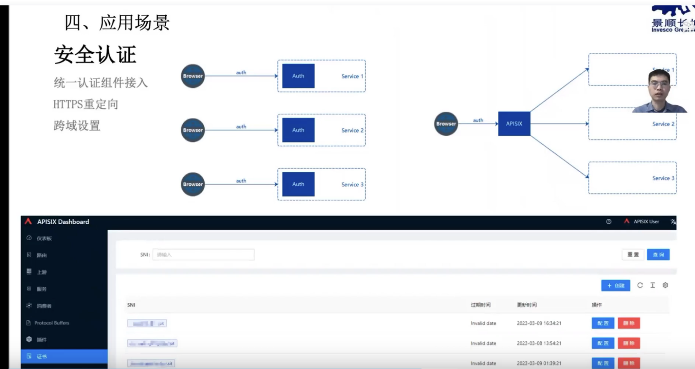
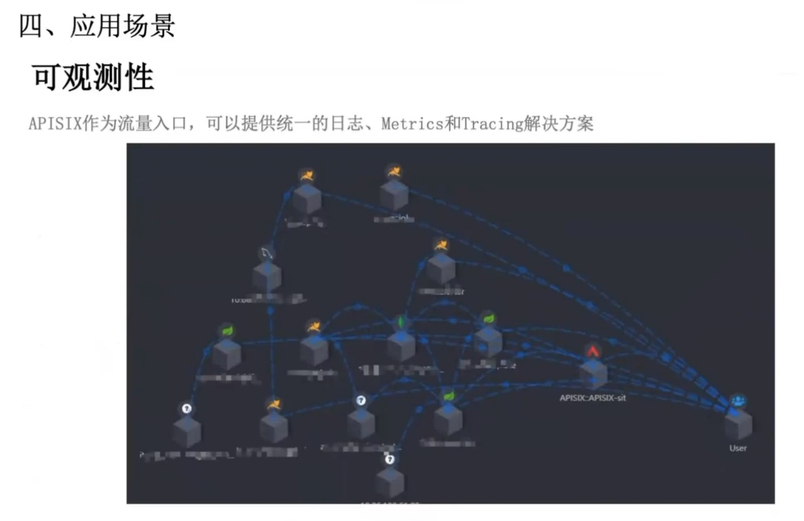

### 景顺长城基于 Apache APISIX 在金融云原生的生产实践

---

### Apache APISIX在有赞的落地实践

### Apache APISIX 在希沃网关的应用与实践

---

### 数百万 QPS！Apache APISIX 在金山办公的落地和实践

### Apache APISIX 在小电的业务实践

### Apache APISIX 在雪球的生产实践

### Apache APISIX Ingress 在又拍云的落地实践

公网网关，容器网关

### 中东社交产品 Beeto 的 Apache APISIX 网关应用实践

### Apache APISIX Ingress Controller 的现在和未来

可以把ingress controller理解为前端(apisix为后端)，可以更方便操作apisix

apisix精细化路由不太容易配置，用APISIX Ingress Controller配置会简单点

